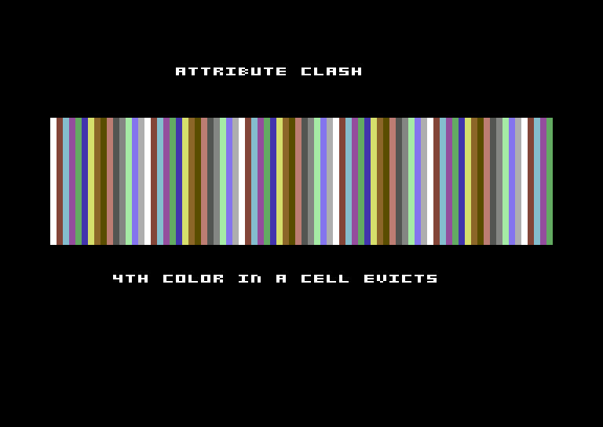

# DIFFERENCES — the two C64 realities to know

c64lua gives you the full PICO-8 draw surface, but the Commodore 64 is not a
PICO-8. Two hardware facts shape every c64lua game. Neither can be engineered
away; both are made legible.

## 1. 2:1 fat pixels (160 x 200 native)

c64lua runs the VIC-II in **multicolor bitmap mode**. Each multicolor pixel is
**two display pixels wide** (2:1), so:

- The canvas is **160 x 200** (coordinates 0-159 x 0-199).
- The displayed picture is **320 x 200**: 160 addressable columns, each drawn
  double-wide, plus the hardware border.

Why multicolor over hires (320 x 200, 2 colors/cell)? PICO-8 code is
color-first: 4 colors per cell (multicolor) halves attribute clash versus 2
(hires) and matches PICO-8's chunky look. c64lua offers one mode, no matrix.

### What this means for circles

`circ()`/`circfill()` draw a true circle in **canvas coordinates** — the radius
is a canvas radius — so a `circfill(x, y, r)` is `r` tall but reads **~2:1 wide**
on screen (each x-pixel is double-wide). That's the honest raw behavior, and it's
a deliberate choice: `pset`, `rect`, `circ`, and `spr` all share ONE coordinate
system (the 160 x 200 canvas), so `pset(x,y)` and `circ(x,y,r)` mean the same
`x`. Pre-squashing circle x-extent inside the runtime would make circle
coordinates inconsistent with every other verb and pull in the float library.

**Want a disc that's round on screen?** Halve each horizontal span's x-extent —
an integer, float-free technique. The `hello` example ships a small `disc()`
helper that does exactly this, which is why its smiley reads round:

So: `circfill` gives you an honest canvas circle (2:1 on screen); the `disc`
pattern in `examples/hello/main.lua` gives you a round-on-screen one. Both are a
few lines and neither touches the float library.

## 2. Per-cell attribute clash (the one graphics catch)

The multicolor bitmap is not a free framebuffer. Each **4 x 8-pixel cell**
displays the shared backdrop color plus **3 free colors** (from screen RAM's two
nibbles and color RAM's nibble). That's the C64's famous **attribute clash**.

c64lua's draw layer maintains a **per-cell color allocator**:

- A `pset` in a color that's new to its cell claims a free slot (there are 3).
- A **4th distinct color** in one cell **evicts** to the nearest existing slot —
  the pixel still draws, but in a color already present in that cell.

Above: a band of 1-pixel vertical stripes in 15 colors. Where more than 3
distinct colors fall in one 4-pixel-wide cell, the extras collapse to the cell's
existing colors — the authentic C64 look you cannot design away, only design
*around*.

### Designing around it

- Keep a region's palette to **3 colors + backdrop** per 4x8 cell.
- Align color changes to cell boundaries (x multiples of 4, y multiples of 8).
- Use **hardware sprites** for multi-color moving objects — MOBs have their own
  color and don't interact with cell colors at all.

### The dev diagnostic

Build with `--dev` (`-DC64_DEV`) and every eviction **flashes the border red**
for that frame and bumps a `c64_clash_count`. Watch the border while you draw:
a flashing border means a region is over its color budget.

## 3. Double-buffered framebuffer (draw every frame, no tearing)

The runtime is **double-buffered**. There are two full framebuffers — buffer A
in VIC bank 3 (`$C000` screen / `$E000` bitmap) and buffer B in VIC bank 2
(`$8000` screen / `$A000` bitmap) — and each frame the runtime **flips which one
the VIC-II displays** (a single CIA2 bank-select write, off the visible area).
Your `_draw` always renders into the *hidden* buffer; `c64_endframe` shows it
once it's complete and swaps. So you `cls()` and redraw the whole scene **every
frame** like any normal game engine, and you **never see a half-drawn frame** —
no tearing.

Two caveats, both fine under a full per-frame redraw:

- **Shared color RAM.** The C64's color RAM (`$D800`, the per-cell "11" nibble)
  is fixed hardware — there's only one, shared by both buffers. Because every
  frame is a full `cls` + redraw, the allocator rewrites it each frame, so the
  two buffers never disagree. (If you tried to persist one buffer and only
  partially redraw the other, the shared color RAM could bleed between them.)
- **Buffer B's bitmap under BASIC ROM.** Buffer B's bitmap (`$A000-$BFFF`) sits
  under the BASIC ROM. The VIC shows the RAM there, and the draw primitives
  write whole bytes for filled spans, so the framebuffer is correct; this is why
  BASIC is left mapped (banking it out to make per-pixel read-modify-write read
  RAM tripped VICE's disk-autostart and reset the machine).

## 4. Performance is a budget, not a given

The C64 is ~1MHz with no blitter — the slowest pixel-pusher in the family.
Double-buffering makes a full-screen redraw every frame **correct and tear-free**,
but it does not make it *fast*: a full 160x200 cls+redraw runs at low-single-digit
fps (the `plasma` example measures **~1.3 fps**). See the measured numbers and the
design patterns (hardware sprites, partial redraw, 30fps) in
[CHEATSHEET.md](CHEATSHEET.md#performance-model-measured--budget-before-you-promise).
The `plasma` example is a live, animated full-screen paint (redrawn every frame)
— honest, if slow, C64 software rendering with no tearing.
