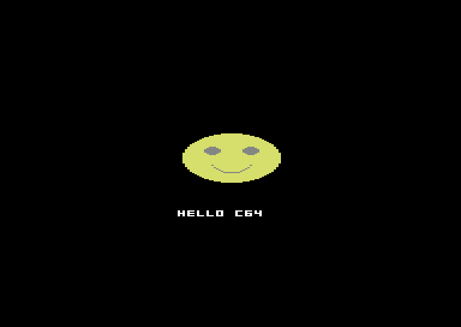

# hello

The c64lua "it works" cart: a centered smiley + centered text, drawn once in
`_init`. Shows `cls`, `circfill`, `pset`, `print`, and the P8→C64 color bake.

```lua
function _init()
  cls(0)                       -- black background
  circfill(80, 96, 20, 10)     -- yellow head (P8 10 -> C64 yellow)
  circfill(72, 90, 3, 6)       -- left eye (blue)
  circfill(88, 90, 3, 6)       -- right eye (blue)
  local i = -8
  while i <= 8 do
    pset(80 + i, 108 - flr((i * i) / 10), 6)   -- a shallow smile
    i += 1
  end
  print("hello c64", 58, 140, 7)   -- white
end

function _draw() end
```



*The eyes read grey, not blue: they land in the same 4x8 cells as the yellow
head, and blue is the 4th color those cells are asked for — so it evicts. That's
authentic C64 attribute clash (see docs/DIFFERENCES.md).*

Build & run:

```sh
npx c64lua build examples/hello/main.lua -o hello.prg --d64 hello.d64
```
