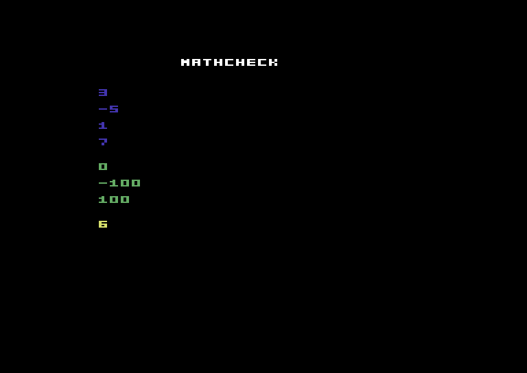

# mathcheck

Fixed-point conformance. Draws a column of known 16.16 PICO-8-semantics results;
read the numbers against the comments to confirm the shared luacretro math core
is correct (floor division, modulo, sqrt, turns-based screen-inverted sin/cos).

```lua
function _init()
  cls(0)
  print("mathcheck", 50, 8, 7)
  print(flr(7 / 2),        20, 30, 1)    -- 3
  print(flr(-9 / 2),       20, 42, 1)    -- -5  (floor, not truncation)
  print(7 % 3,             20, 54, 1)    -- 1
  print(flr(sqrt(49)),     20, 66, 1)    -- 7
  print(flr(sin(0) * 100),     20, 84, 3)    -- 0
  print(flr(sin(0.25) * 100),  20, 96, 3)    -- -100  (P8 inverted sin)
  print(flr(cos(0) * 100),     20, 108, 3)   -- 100
  print(flr(1.5 * 4),      20, 126, 10)  -- 6
end

function _draw() end
```



*Every value matches its comment — the fixed-point core is byte-goldened across
the whole luacretro family and verified on real C64 hardware here.*
