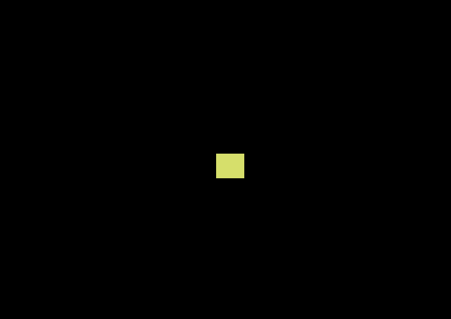

# pad-square

Move a hardware sprite (a VIC-II MOB) with the joystick (port 2 = player 1).
Hardware sprites move freely over the bitmap at zero per-frame draw cost and
don't interact with cell colors — the right tool for a moving object on the C64.

```lua
local x = 76
local y = 96
local col = 7

function _update60()
  if btn(0) then x -= 2 end   -- left
  if btn(1) then x += 2 end   -- right
  if btn(2) then y -= 2 end   -- up
  if btn(3) then y += 2 end   -- down
  if btnp(4) then col += 1; if col > 15 then col = 1 end end  -- fire cycles color
  x = mid(0, x, 152)
  y = mid(0, y, 179)
end

function _draw()
  color(col)
  spr(0, x, y)
end
```



*Hold right and the square drives to the screen edge — verified through the
emulator. `btn(4)` is the joystick's one fire button; `btn(5)` maps to SPACE on
real hardware.*
