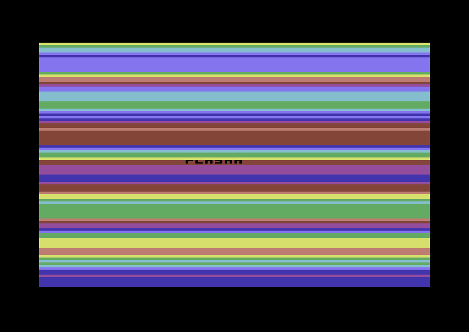

# plasma

The framebuffer flex. The C64 has a REAL framebuffer (VIC-II bitmap), so
full-screen CPU rendering works with no queue and no vblank wall — the draw
surface the NES cannot offer. This paints sine-shaped horizontal color bands
straight into the 160x200 canvas, one `rectfill` per row (no overdraw), so the
whole screen fills in a single pass.

```lua
local ramp = {6, 14, 3, 5, 7, 10, 2, 4}   -- an 8-color cycle

function _init()
  cls(6)
  local y = 0
  while y < 200 do
    local phase = flr((sin(y / 60) + 1) * 4) + y / 12
    local c = ramp[(flr(phase) % 8) + 1]
    rectfill(0, y, 159, y + 1, c)
    y += 2
  end
  print("plasma", 60, 94, 0)
end

function _draw() end
```



*Drawn ONCE in `_init`: at ~1MHz a full-screen paint is many frames, so a live
per-frame plasma would be seconds-per-frame. Static full-screen art like this is
the right way to flex the framebuffer on the C64 (see docs/CHEATSHEET.md perf).*
